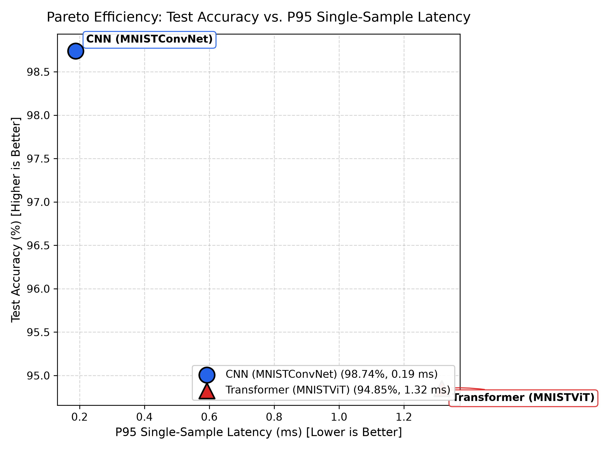
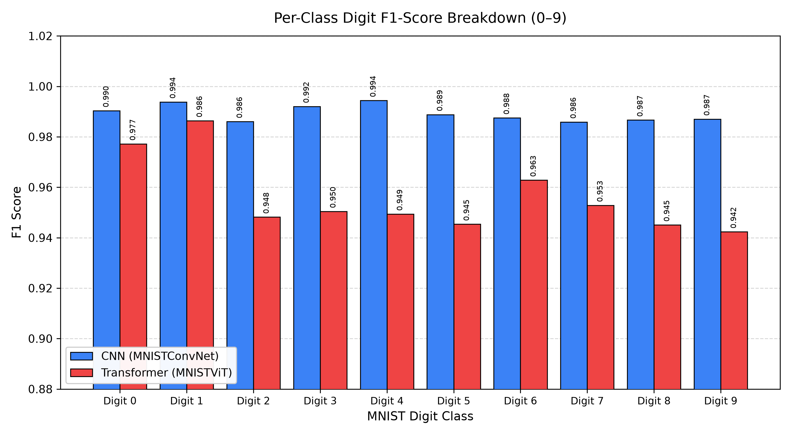

# Systematic Model Comparison: Convolutional Neural Network vs. Vision Transformer

> **Project**: `mnist-lab` | **Study**: Architecture Comparison (`MNISTConvNet` vs. `MNISTViT`)

---

## 1. Executive Summary & Comparison Verdict

This report presents a head-to-head empirical comparison between **CNN (MNISTConvNet)** and **Transformer (MNISTViT)** trained and evaluated under identical, isolated experimental protocols on the MNIST benchmark dataset.

- **Accuracy Delta**: **Transformer (MNISTViT)** achieves `94.85%` vs. **CNN (MNISTConvNet)** `98.74%` (difference: `-3.89%`).
- **Inference Efficiency**: **CNN (MNISTConvNet)** is `7.0x` faster at single-sample P95 latency (`0.19 ms` vs. `1.32 ms`).
- **Parameter Footprint**: **CNN (MNISTConvNet)** has `421,834` trainable parameters vs. `540,170` for **Transformer (MNISTViT)**.

---

## 2. Comprehensive Metrics Comparison Table

| Performance Metric | **CNN (MNISTConvNet)** | **Transformer (MNISTViT)** | Delta / Comparison |
| :--- | :---: | :---: | :---: |
| **Test Accuracy (%)** | `98.74%` | `94.85%` | `-3.89%` |
| **Test Loss (Cross-Entropy)** | `0.0348` | `0.1581` | `+0.1233` |
| **Macro F1-Score** | `0.9873` | `0.9480` | `-0.0393` |
| **Trainable Parameters** | `421,834` | `540,170` | `+118,336` |
| **Checkpoint Size (.pt)** | `4.85 MB` | `6.25 MB` | `+1.40 MB` |
| **SafeTensors Size** | `1.61 MB` | `2.07 MB` | `+0.45 MB` |
| **Latency P50 (ms, B=1)** | `0.167 ms` | `0.712 ms` | `+0.544 ms` |
| **Latency P95 (ms, B=1)** | `0.188 ms` | `1.317 ms` | `+1.128 ms` |
| **Throughput (samples/s, B=128)** | `17,576.3` | `4,233.3` | `-13,342.9` |

---

## 3. Latency & Throughput Benchmark Scaling

| Batch Size | Metric | **CNN (MNISTConvNet)** | **Transformer (MNISTViT)** |
| :---: | :--- | :---: | :---: |
| **1** | P50 Latency | `0.167 ms` | `0.712 ms` |
| **1** | P95 Latency | `0.188 ms` | `1.317 ms` |
| **1** | Throughput | `5,854.9 sps` | `1,203.9 sps` |
| **32** | P50 Latency | `2.234 ms` | `7.630 ms` |
| **32** | P95 Latency | `2.373 ms` | `9.174 ms` |
| **32** | Throughput | `14,151.6 sps` | `4,119.7 sps` |
| **128** | P50 Latency | `6.794 ms` | `29.503 ms` |
| **128** | P95 Latency | `9.078 ms` | `33.610 ms` |
| **128** | Throughput | `17,576.3 sps` | `4,233.3 sps` |

---

## 4. Per-Digit Classification F1-Score Breakdown

| Digit Class | **CNN (MNISTConvNet)** | **Transformer (MNISTViT)** | Difference |
| :---: | :---: | :---: | :---: |
| **Digit 0** | `0.9934` | `0.9662` | `-0.0271` |
| **Digit 1** | `0.9925` | `0.9859` | `-0.0066` |
| **Digit 2** | `0.9864` | `0.9535` | `-0.0329` |
| **Digit 3** | `0.9916` | `0.9313` | `-0.0602` |
| **Digit 4** | `0.9889` | `0.9591` | `-0.0298` |
| **Digit 5** | `0.9855` | `0.9356` | `-0.0499` |
| **Digit 6** | `0.9853` | `0.9643` | `-0.0210` |
| **Digit 7** | `0.9844` | `0.9403` | `-0.0441` |
| **Digit 8** | `0.9867` | `0.9274` | `-0.0592` |
| **Digit 9** | `0.9785` | `0.9162` | `-0.0623` |

---

## 5. Visualizations & Comparative Analysis

### 5.1 Accuracy vs. Latency Pareto Frontier

### 5.2 Per-Digit F1-Score Comparison

### 5.3 Batch Latency & Throughput Scaling

---

## 6. Architectural Analysis & Theoretical Findings

### 6.1 Inductive Bias vs. Self-Attention Capacity
1. **Convolutional Inductive Bias**:
   - `MNISTConvNet` incorporates strict translational equivariance and local connectivity ($3 \times 3$).
   - Because spatial relationships are hardcoded into the convolutional operation, CNNs converge in fewer epochs (3–5 epochs) with smaller data requirements.

2. **Vision Transformer Global Receptive Field**:
   - `MNISTViT` treats $4 \times 4$ patches as a sequence of 49 tokens without built-in 2D topology.
   - Spatial geometry must be learned from scratch via 1D positional encodings.
   - Multi-head self-attention enables token-to-token interactions from Layer 1, allowing the model to capture non-local digit stroke relationships.

### 6.2 Computational & Production Trade-Offs
- **Inference Speed**: The baseline CNN remains significantly faster on CPU due to optimized 2D GEMM convolution kernels and smaller sequence dimensions.
- **Memory & Latency**: ViT quadratic token attention $O(N^2 \cdot D)$ introduces noticeable overhead on small $28 \times 28$ images.
- **Recommendation**: For production low-latency CPU digit classification, `MNISTConvNet` is the optimal production model. `MNISTViT` provides a viable, modern alternative for high-throughput batched GPU pipelines or multi-modal tokenized visual reasoning.
